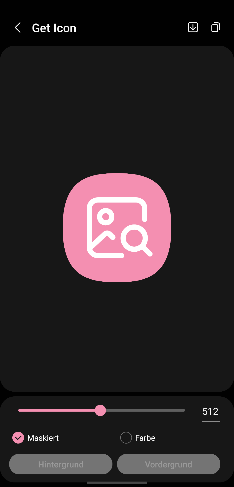
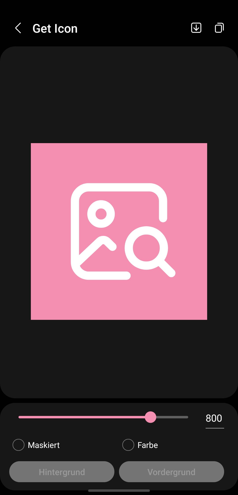
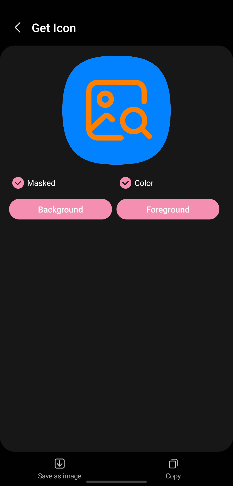
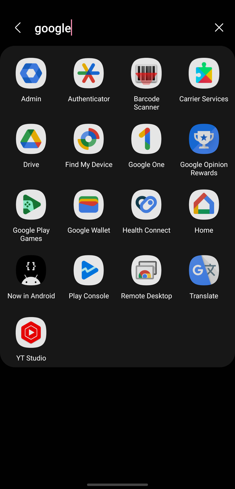

<!--suppress HtmlDeprecatedAttribute CheckImageSize-->

# Get Icon

An app to extract and save app icons.

  

Credits: [https://github.com/Yanndroid/GetIcon](https://github.com/Yanndroid/GetIcon)

More Information: <a target="_blank" href='https://www.leonard-lemke.com/apps/geticon'>www.leonard-lemke.com </a>

  

 

<picture>
    <!--suppress HtmlUnknownTarget -->
    <source media="(prefers-color-scheme: dark)" srcset="https://api.star-history.com/svg?repos=Lemkinator/GetIcon&type=Date&theme=dark" />
    
</picture>

